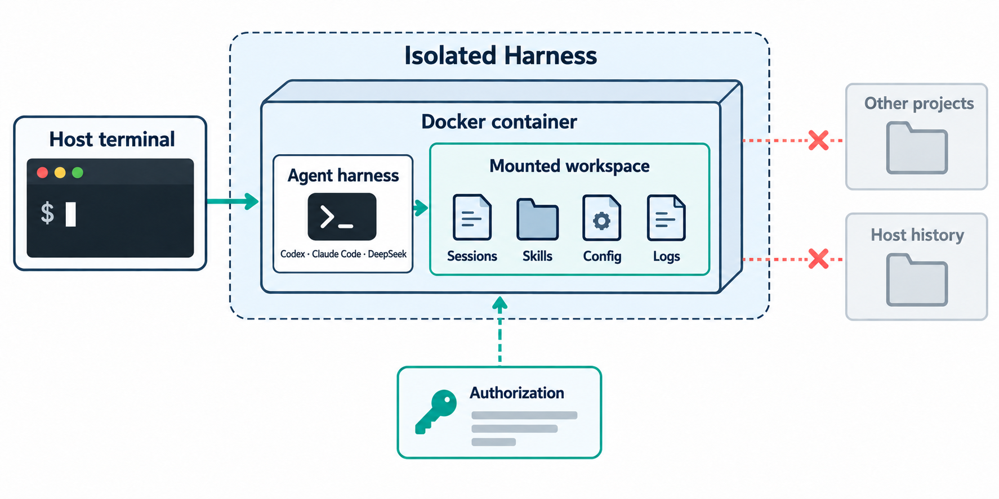

# Isolated Harness

> **A mounted-workspace isolation layer for agent CLIs.**

Isolated Harness starts a real agent harness inside a container, with only the workspace you selected mounted into it. It keeps the agent effective on the real project while isolating unrelated host directories, chat memory, Skills, configuration and tool state.

**Keywords:** agent isolation · mounted workspace · memory isolation · context isolation · authorization projection · Codex CLI · Claude Code · DeepSeek · Skills evaluation · agent pipelines · reproducible experiments

  

## What it isolates

- **Mounted workspace.** The selected directory is bind-mounted directly, so the harness can edit the actual project. Other projects and the host home are not mounted.
- **Memory and state.** Each project and named session has its own agent state. One chat or project does not silently inherit another chat's history, logs, Skills, plugins or configuration.
- **Capabilities.** Skills, MCP servers and plugins are selected deliberately. Their selected versions and sources can be recorded for an evaluation or an engineering run.
- **Authorization.** An adapter may project the minimum authorization material required for a run, then removes that projection when the run ends. Usable credentials are not written into the mounted workspace.

## Authorization and model access

Isolated Harness is an isolation layer; it does not replace your agent account, subscription, model provider or billing relationship.

- **Subscription login:** retain a harness's existing official login. The current Codex adapter uses the host's active Codex authorization through a temporary private mount, without importing the host's chat history or agent home.
- **Official APIs:** an adapter may use the provider's official API authorization and endpoint when that is how the harness is configured.
- **Other approved providers:** adapters may support an organization-approved gateway, self-hosted endpoint or another provider's authorization model, subject to the same explicit mount, state and capability rules.

Authorization is adapter-specific. The boundary stays the same: authorization enables the selected harness to reach its model service; it does not grant access to unmounted host files or another session's memory.

## Harnesses

| Harness | Status | Authorization model |
| --- | --- | --- |
| Codex CLI | Available | Existing host Codex login is projected privately for the run. |
| Claude Code | Planned | Will preserve its supported official login or API flow inside the same isolation contract. |
| DeepSeek harness | Planned | Will support its configured official or approved-provider API flow inside the same isolation contract. |
| Additional harnesses | Planned | Every adapter shares the mounted-workspace, memory-isolation and capability contracts. |

## Requirements

An isolated run requires:

1. A supported container runtime, currently Docker Desktop.
2. An explicit host directory to mount as the workspace. Direct write access to that directory is intentional.
3. A selected harness image and a valid authorization source for that harness: an existing subscription login, an official API configuration, or an approved provider configuration.
4. Explicitly selected Skills, configuration, MCP servers or plugins when the task needs them. They are not inherited from unrelated host sessions by default.
5. Network egress for a hosted model in the standard contained profile, or an offline-compatible harness for the offline profile.

The [requirements document](docs/REQUIREMENTS.md) describes the runtime, authorization, isolation and adapter requirements in detail.

## Documentation

- [Quick Start](docs/QUICKSTART.md) — prepare a workspace, launch an agent and resume it.
- [Deployment](docs/DEPLOYMENT.md) — run Isolated Harness on a workstation or a self-hosted engineering service.
- [Usage](docs/USAGE.md) — Skills, configuration, sessions and JSONL application integration.
- [Requirements](docs/REQUIREMENTS.md) — environment, authorization and adapter requirements.
- [Prepared environments](docs/ENVIRONMENTS.md) — reusable Python, document, browser/Chromium, and drawing-review images outside the workspace.
- [Managed workspace runtimes](docs/ENVIRONMENTS.md#reuse-a-runtime-produced-by-a-workspace) — import an agent-built Linux runtime once and reuse it read-only across projects.
- [Product requirements](docs/PRD.md) — product model, threat model and adapter contract.
- [Implementation status](docs/IMPLEMENTATION.md) — implemented behavior and remaining work.
- [Chat isolation demo](docs/CHAT_ISOLATION_DEMO.md) — evidence for continuity within one chat and isolation between chats.
